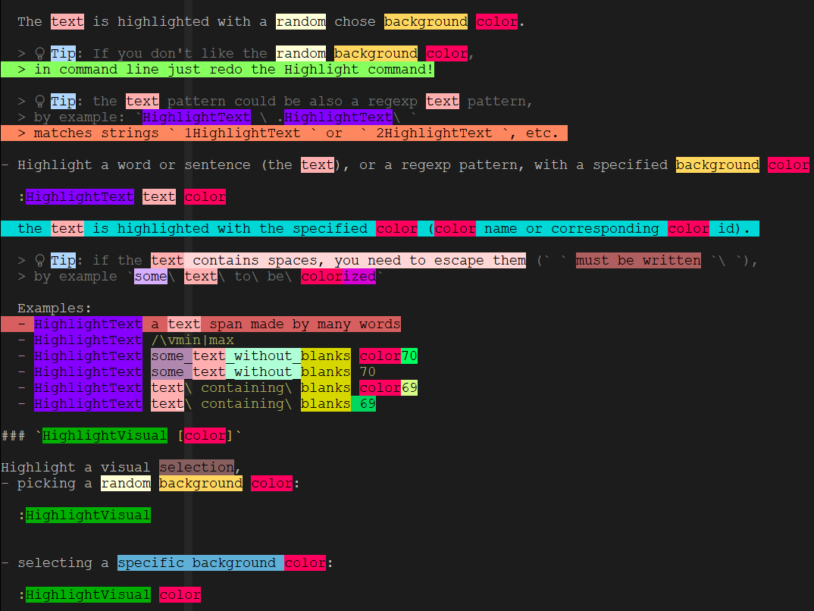

# Highlight.vim

**If you like the project, please ⭐️star this repository to show your support! 🙏**



Highlight.vim plugin is a pattern-based text background colorizer, 
that highlights span of texts (words, sentences, paragraphs),
using a background color, random picked or specified by user.

A set of user commands (in command mode) are supplied to select text 
in a bunch of different ways, from direct set, visual selection, etc.

**What's the point?**

Sometime you need to highlight words, sentences or any character spans in your text files, 
with a nice background color, with the goal of point out keywords, labels, tags, important sections, etc.

I personally have this need: 

- When analyzing a text, with the aim to select linguistics entities (verbs, nouns, special keywords), 
  with the help of a nice visual overview of different kind of contents

- When annotating intents and entities in "conversational AI" / chatbot tools, 
  like [RASA](www.rasa.com) and similar

- When programming in a standard programming language (NodeJs, Python) 
  just to put in evidence function names, variables, etc.

**What's the original goal?**

This project is related to the original (open) points raised from my vi stackexchange questions:

- [Vim editor entities tagging/annotation tool](https://vi.stackexchange.com/questions/34821/vim-editor-entities-tagging-annotation-tool) 
- [How to replace selected text T with some function(T), using a keyboard shortcut?](https://vi.stackexchange.com/questions/34823/how-to-replace-selected-text-t-with-some-functiont-using-a-keyboard-shortcut/34824#34824) 

The final goal is to create a plugin to annotate "conversational AI" / NLP attributes 
(intents, entities, etc.) within the vim editor! Stay tuned!

 **Background colors?**

What I mean with *highlight* is to colorize the background of a text span.

This plugin currently uses a subset of cterm/xterm 256 colors, suitable for terminal mode.

    highlight color31  ctermbg=31  ctermfg=0

I decide to use black (ctermfg=0) as fixed foreground color. That's opinabile.
The reason why of the subset is because some (too dark) colors 
do not make a suitable contrast with the black foreground color. 

 **A pattern-based colorizer?**

Behind the scenes the plugin uses `matchadd` vimscript function (`help matchadd`). 

This means that if you highlight a text span instance (say the keyword `temperature_body`), 
in facts **all occurrences** of the same text are highlighted with the same color, 
in the current buffer. This is smart and maybe what you are looking for in many cases. 


## Install

Using vim-plug, in your `.vimrc` file:

    Plug 'solyarisoftware/Highlight.vim'


## Usage

In vim command mode (`:`) these commands are available:

Explicit text highlight:
| command                            | description                                                           |
| ---                                | ---                                                                   |
| `:HighlightText text [color]`      | highlights a text/regexp with a random or specified color             |

Visual/Motion highlight:
| command                            | description                                                           |
| ---                                | ---                                                                   |
| `:HighlightVisual [color]`         | highlights a visual selection  with a random or specified color       |
| `:HighlightLine [color]`           | highlights the current line with a random or specified color          |
| `:HighlightYanked [color]`         | highlights the yanked text with a random or specified color           |
| `:HighlightCursor [color]`         | highlights the word under the cursor with a random or specified color |
| `:HighlightSearch [color]`         | highlights the searched text with a random or specified color         |

Utilities:
| command                            | description                                                           |
| ---                                | ---                                                                   |
| `:HighlightColors`                 | visualizes all available colors                                       |
| `:HighlightUndo`                   | undo lasts highlight command                                          |
| `:HighlightLabelColor label color` | Assign a label (alias) to a color name                                |
| `:HighlightLoadScript script_file` | execute all Highlight commands in specified script file               |


### `:HighlightText text [color]`

Highlight a word or sentence, or any regexp pattern, picking a random background color:

    :HighlightText text

The `text` is highlighted with a random chose background color.

💡Tip:
If you don't like the random background color, 
in command line just redo the Highlight command!

💡Tip:
the text pattern could be also a vimscript regexp pattern, 
by example: `HighlightText \ .HighlightText\ ` 
matches strings ` 1HighlightText ` or  ` 2HighlightText `, etc. 

Highlight a word or sentence (the `text`), or a regexp pattern, with a specified background `color`

    :HighlightText text color

The `text` is highlighted with the specified `color` (color name or corresponding color id). 

💡Tip:
if the text contains spaces, you need to escape them (` ` must be written `\ `), 
by example `some\ text\ to\ be\ colorized`

Examples:
- `HighlightText a text span made by many words`
- `HighlightText /\vmin|max`
- `HighlightText some_text_without_blanks color70`
- `HighlightText some_text_without_blanks 70`
- `HighlightText text\ containing\ blanks color69`
- `HighlightText text\ containing\ blanks 69`
- `:HighlightText \[\zs.\{-}\ze\](address) 112`


### `:HighlightVisual [color]` 

Highlight a visual selection

Picking a random background color:

    :HighlightVisual 

Selecting a specific background color:

    :HighlightVisual color

💡Tip: 
you can just pass the `color` as a number, `HighlightVisualWithColor 123`

Examples:
- `HighlightVisual`
- `HighlightVisual 71`
- `HighlightVisual color71`


### `:HighlightColors` 

Show the list of available colors, highlighting each color name:

    :HighlightColors

A color name is one of the items: 
`color17`, `color18`, ..., `color254`, `color255`

💡Tip:
in all commands below you can just pass the color also as a number, 
by example: `color18` could be referred also as `18`


### `:HighlightLabelColor label color` 

💡Tip:
in all commands below you can just pass the color also as a number, 
Assign a label (alias) name to a color name. 
In that way you could afterward use the custom label instead of a color name or number.
That's useful when you want to assign logical classes (labels) to the same color, 
for a visual "unification", by example:

```
:HighlightLabelColor verb color55
:HighlightText go verb
:HighlightText went verb
:HighlightText come verb
:HighlightText came verb
```


### `:HighlightLoadScript script_file` 

Execute all Highlight commands in specified script file.
By example you want to highlight a list of keywords at once.

1. you create a script file `my_highlight.script` containing all your Highlight commands as:

   ```
   "
   " my_highlight.script
   "
   HighlightText my_keyword              color43
   HighlightText anoter_keyword          color43
   HighlightText a_third_keyword         color43
   HighlightText a\ sentence             color109
   HighlightText another\ full\ sentence color78
   HighlightText again_another_keyword   color55
   ``` 

2. Afterward you run the script from command mode:

   ```
   :HighlightLoadScript my_highlight.script
   ```


## Keyboard shortcuts

💡Tip: You can use vim key map to assign an Highlight.vim command to a key.

By example, to assign the command `:HighlightText Screenshots` to the key `F2`:

```
map <F2> :HighlightText Screenshots<CR>
```

Or you want to assign the command `:HighlightYanked 134` to the key `F3`:

```
map <F3> :HighlightYanked 134<CR>
```

Or suppose you want to highlight a text with a casual color

```
:HighlightText Screenshots<CR>
```

But you are unhappy with the background color, so you can repeat the last command with:

```
:map <F3> @:

:HighlightText Screenshots<CR>
```

For now on, `F3` repeat last command, so highlighting with a new random color!


## Usage Examples/Screenshots

Many usage examples [here](screenshots/)


## To do

- Make highlights persistent, saving on file all changes.
  So far you can load a script of *Higlighlight.vim* commands, 
  using `:HighlightLoadScript my_highlight.script`. 
  The specular function (save all  *Higlighlight.vim* commands) must be implemented

##  Changelog

- v.0.9.0 
  - s:rand() random function implemented locally in vimscript, 
    allowing retro compatibility with Vim versions <= 8.1 
  - many usage examples (with screenshots) added
  - command `:HighlightScript` has renamed `:HighlightLoadScript`

## Similar projects

- https://github.com/lfv89/vim-interestingwords
- https://github.com/joanrivera/vim-highlight


## Status / How to contribute

This project is work-in-progress.

I'm not a vimscript expert, so any contribute is welcome.

**If you like the project, please ⭐️star this repository to show your support! 🙏**

For any proposal and issue, please submit here on github issues for bugs, suggestions, etc.
You can also contact me via email (giorgio.robino@gmail.com).


## Licenze

MIT (c) Giorgio Robino


[top](#)
