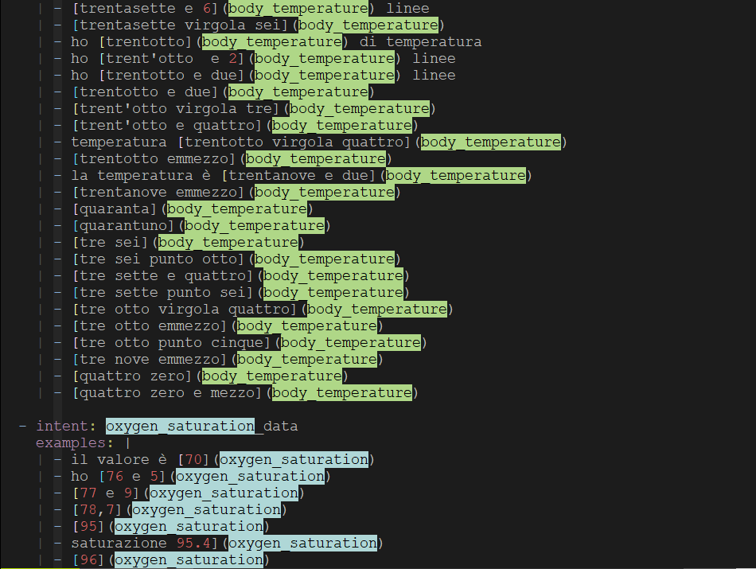
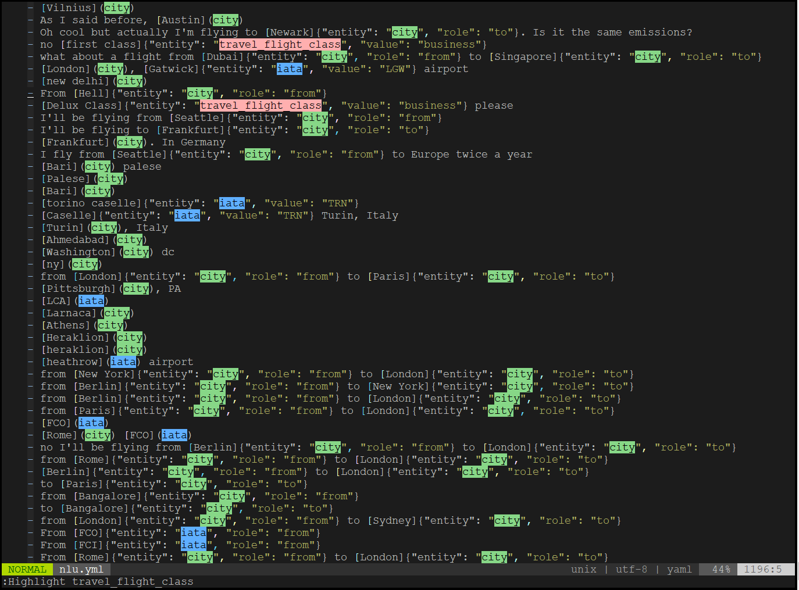
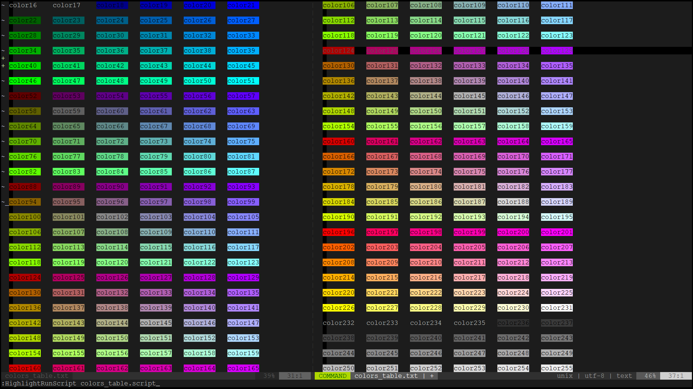
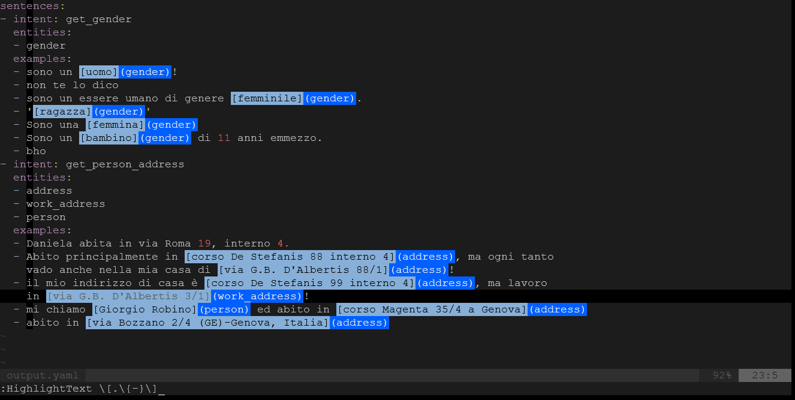

# Usage examples (with screenshots)

## Example 1: highlight entity names in a RASA NLU configuration file 

```
:HighlightText body_temperature
:HighlightText oxygen_saturation
```




## Example 2: highlight entity names in a RASA NLU configuration file 

```
:HighlightText city
:HighlightText iata
:HighlightText travel_flight_class
```



## Example 3: highlight all color names 

```
vi [color_table.txt](../texts/color_table.txt)
```

```
:HighlightScript [color_table.script](../texts/color_table.script) 
```




## Example 4: highlight entities having syntax [entity_value](entity_name) 

Vim regexp to select (search) entity_names (including square brackets):
```
/(.\{-})
```

Vim regexp to select (search) entity_values (including round brackets):
```
/\[.\{-}\]
```


### 4.1 Highlight entity names

Simply use multiple `HighlightText entity_name` commands:


### 4.2 Highlight entity values and entity names with 2 different colors

```
:HighlightText \[.\{-}\] color
:HighlightText (.\{-}) another_color
```




### 4.3 Highlight entity value+name couples with different colors by entity 

You want to colorize `gender` entity name with a given color number.
And you want to colorize corresponding value with the same color:

```
:HighlightText (\zsgender\ze) 217
:HighlightText \[\zs.\{-}\ze\](gender) 217
```

So you want to colorize entity `address` with a different color:

```
:HighlightText (\zsaddress\ze) 112
:HighlightText \[\zs.\{-}\ze\](address) 112
```


---

[top](#) | [home](../README.md)
